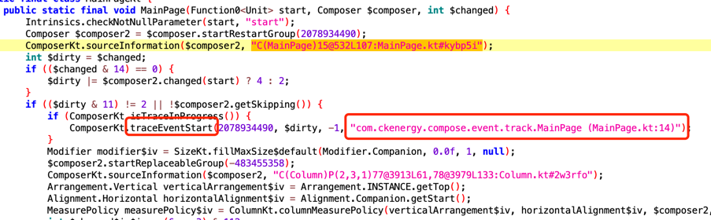
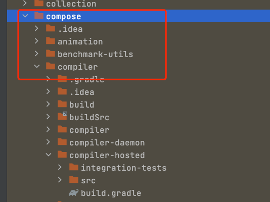

## 如何利用kcp和asm自动给 compose 事件（页面切换和点击）埋点

### 前言
最近公司同事开发了一套用户行为日志自动采集框架，可是不巧的是，这套埋点不支持compose，而当时公司基本就我在用compose开发需求，上网看了一圈没发现有关compose的埋点，于是打算自己写过

### 1、页面切换事件
compose页面切换可以**NavController.addOnDestinationChangedListener**设置监听，所以这里就可以用ASM在**NavController**的构造方法里直接添加监听就行了，
```kotlin
private const val LISTENER_CLASS = "com/ckenergy/cet/core/compose/CETDestinationChangedListener"

//把监听加入到NavController中
mv.visitFieldInsn(
    GETSTATIC,
    LISTENER_CLASS,
    "Companion",
    "L$LISTENER_CLASS\$Companion;"
)
mv.visitVarInsn(ALOAD, 0)
mv.visitTypeInsn(CHECKCAST, "androidx/navigation/NavController")
mv.visitMethodInsn(
    INVOKEVIRTUAL,
    "$LISTENER_CLASS\$Companion",
    "register",
    "(Landroidx/navigation/NavController;)V",
    false
)
//自己定义一个监听
class CETDestinationChangedListener: NavController.OnDestinationChangedListener {

    override fun onDestinationChanged(
        controller: NavController,
        destination: NavDestination,
        arguments: Bundle?
    ) {
        AutoTrackHelper.trackViewScreen(destination.route)
    }

    companion object{
        @JvmStatic
        fun register(controller: NavController) {
            controller.addOnDestinationChangedListener(CETDestinationChangedListener())
        }
    }
}
```
页面切换的情况比较简单，如果不太懂ASM可以先google一下，这里不过多介绍

### 2、点击事件
compose设置点击事件的方法是这样的**fun Modifier.clickable(...., onClick: () -> Unit)**，onClick参数类型是**() -> Unit**在经过kotlin的编译器后会变成Function<Unit>类型的的数据，
假如我们用ASM对onClick插桩的话，无法获取上下文的信息，我们也不知道他是哪里点击的
然后我打算反编译apk看看compose编译器会不会对clickable生成一些其他的信息，最后发现这个方法**ComposerKt.traceEventStart**

可以看到这里有个参数是这个方法的名字和所在的行数，这不正式我需要的吗（知道方法名和行数就知道用户点击了哪里）
然后google compose compiler 找到了编译器的[源码](https://android.googlesource.com/platform/frameworks/support/+/refs/heads/androidx-main/)

在这个目录下的这个类ComposableFunctionBodyTransformer
compose这里使用的是KCP（Kotlin Compiler Plugin）的方式，可以在kotlin编译的过程中修改或添加一些方法，关于KCP的介绍大家可以看看这篇[文章](https://juejin.cn/post/7095248182912745502)，
我这里也不过多介绍了
```kotlin
class ComposeClickTransformer(
    private val pluginContext: IrPluginContext,
) : IrElementTransformerVoidWithContext() {

    override fun visitCall(expression: IrCall): IrExpression {
        val origin = super.visitCall(expression) as IrCall
        //判断调用的方法是否是clickable
        if (expression.symbol.owner.kotlinFqName.asString() == Constants.COMPOSE_CLICK) {
            Log.w(TAG,"StatementTransformer visitCall  ${expression.symbol.owner.kotlinFqName.asString()}:: ${expression.render()}")
            //获取最后一个参数是lambda的表达式
            val lambda = origin.getValueArgument(origin.valueArgumentsCount - 1) as? IrFunctionExpression
            if (lambda?.function?.body != null)//在lambda表达式中添加插桩
                lambda.function.body = lambda.function.addIrClickable(pluginContext, lambda.function.body!!)
        }
        return origin
    }
}
```
按照kcp的要求自定义一个IR Transformer来获取clickable的方法调用，获取到lambda表达式后添加我们的代码**AutoTrackHelper.trackClick**
```kotlin
/**
 * 调用[Constants.TRACK_CLASS].trackClick方法
 */
fun IrPluginContext.trackClickFunc(): IrSimpleFunctionSymbol? =
    kotlin.runCatching { referenceClass(FqName(Constants.TRACK_CLASS))?.functionByName("trackClick") }.getOrNull() /*?: printlnFunc()*/

/**
 * 在body中添加trackClickFunc()
 */
fun IrFunction.addIrClickable(
    pluginContext: IrPluginContext,
    irBody: IrBody
): IrBlockBody {
    return DeclarationIrBuilder(pluginContext, symbol).irBlockBody {
        addClickTrack(pluginContext, this@addIrClickable)?.let {
            +it
        } //打印目标函数信息

        +irBlock(resultType = this@addIrClickable.returnType) {
            for (statement in irBody.statements) { //原有方法体中的表达式
                +statement
            }
        }
    }
}

fun IrBuilderWithScope.addClickTrack(
    pluginContext: IrPluginContext,
    function: IrFunction
): IrCall? {
    val concat = irConcat() // 拼接目标函数信息 【方法名（）】
    val name = function.kotlinFqName.asString().replaceAfterLast(Constants.LAMBDA_NAME, ".clickable")
    val file = function.file.name
    val line = function.file.fileEntry.getLineNumber(function.startOffset) + 1
    val traceInfo = "$name ($file:$line)"
    Log.w("addClickTrack", traceInfo)
    concat.addArgument(irString(traceInfo))

    val func = pluginContext.trackClickFunc()

    if (func != null)
        return irCall(func).also {
            it.putValueArgument(0, concat)
        }
    return null
}
```
然后我们点击就会输出


### 参考资料
1、[深入浅出 Compose Compiler（1） Kotlin Compiler & KCP](https://juejin.cn/post/7153076275207208991)

2、[Kotlin-KCP的应用-第二篇](https://juejin.cn/post/7096720525799473165#heading-14)

3、[compose compiler](https://android.googlesource.com/platform/frameworks/support/+/refs/heads/androidx-main/compose/compiler/)


